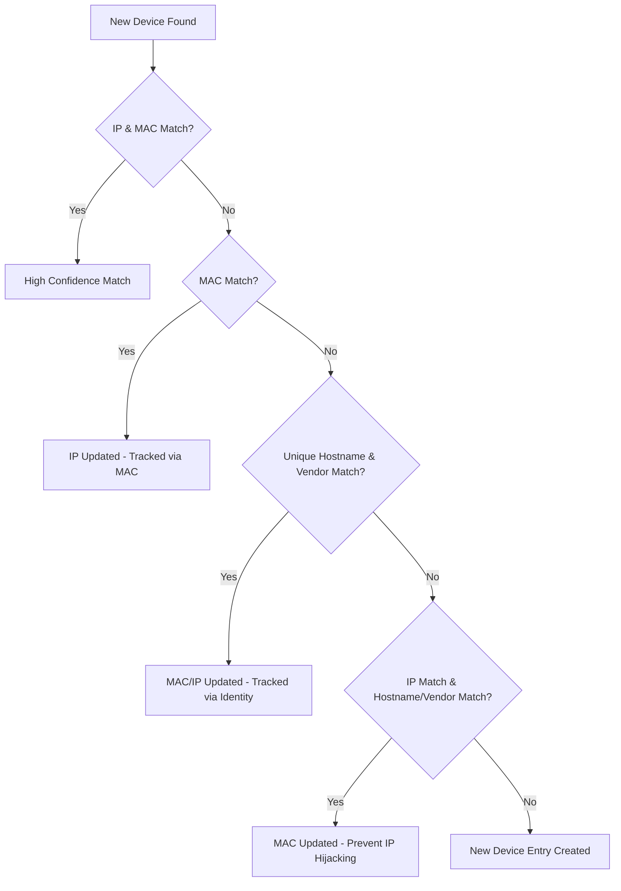
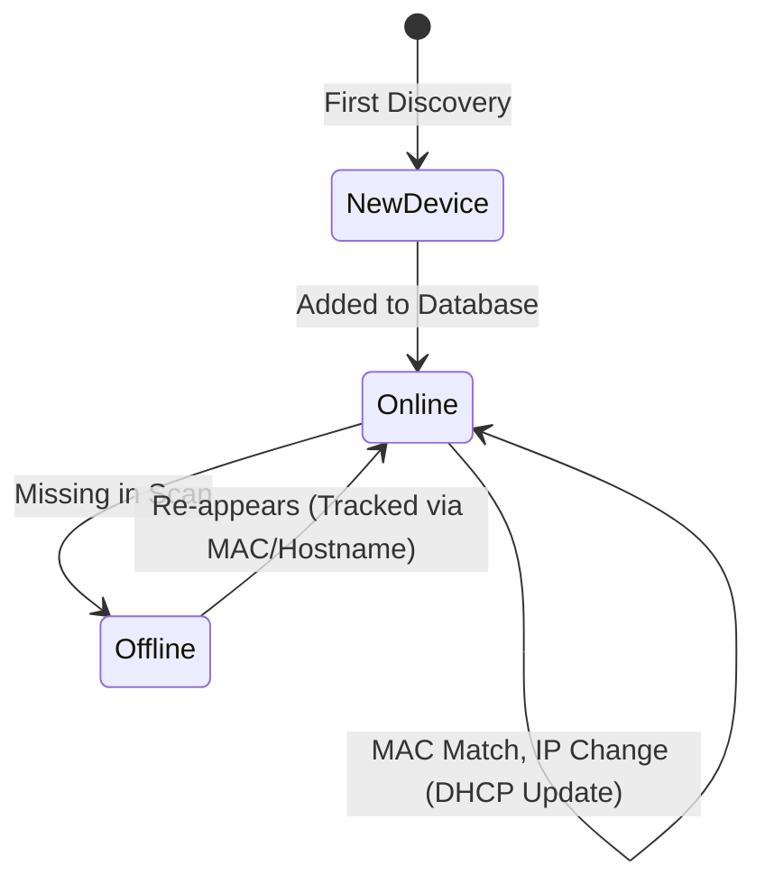

# How NetScan Tracks Your Devices

NetScan goes beyond a simple IP scan. It employs a multi-tiered intelligent matching system to ensure that your devices are tracked accurately, even when their IP addresses change or they present different network identities.

## The Matching Hierarchy

When NetScan finds a device on your network, it tries to match it against its existing database using the following priority levels:

### 1. The Perfect Match (IP & MAC)
If both the **IP Address** and the **MAC Address** match an existing record, NetScan is highly confident this is the same device. This is the most common scenario for stable network environments.

### 2. MAC Address Recognition
If the MAC address matches an existing device but the IP is different, NetScan assumes the device has been assigned a new IP address by your router (common with DHCP). It updates the record with the new IP and marks the old IP as "additional".

### 3. Identity Verification (Hostname & Vendor)
If neither the IP nor the MAC matches perfectly, NetScan looks at the **Hostname** and the **MAC Vendor** (the manufacturer). 
* **Condition:** The hostname must be unique in the current scan.
* If a unique hostname and its associated manufacturer match an existing record, NetScan assumes it's the same device and updates its network details accordingly.

### 4. IP Match with Verification
If only the IP matches but the MAC is different, NetScan won't blindly overwrite the record. It first verifies that the **Hostname** and **Vendor** also match. This prevents "IP hijacking" scenarios where a new device takes an old IP previously used by another device.

---

## Smart Features

### Tracking History
NetScan doesn't just overwrite old data. It maintains lists of:
* **Additional IPs:** Every IP address a device has been seen using.
* **Additional MACs:** Helpful for devices with multiple network interfaces (like a laptop with both Wi-Fi and Ethernet).

### Multi-Identity Detection
The system automatically flags devices that appear to have:
* **Multiple MACs** for a single IP.
* **Multiple IPs** for a single MAC.
This is particularly useful for identifying Virtual Machines, network bridges, or devices using MAC randomization.

### Offline Awareness
Devices that aren't found in the current scan are marked as `offline` rather than being deleted. This allows you to maintain a historical record of everything that has ever connected to your network.

---

## Appendix: The "Why" and The Future

### Why This Complexity?
In modern networks, identities are fluid:
* **DHCP Leases:** Your router periodically reassigns IP addresses.
* **MAC Randomization:** Modern smartphones and OSs often change their MAC addresses for privacy when connecting to Wi-Fi.
* **Multiple Interfaces:** A single physical device (like a docked laptop) might use different MACs depending on how it's connected.

Standard scanners often see these changes as "new" devices, cluttering your database. NetScan's logic "collapses" these multiple identities into a single logical device.

### Future Enhancements
We are looking into adding even more robust tracking techniques:
* **Active Fingerprinting:** Probing open ports and analyzing TCP/IP stacks to identify Operating Systems.
* **Discovery Protocols:** Utilizing mDNS (Bonjour), LLMNR, and NetBIOS to gather more identity clues.
* **Proactive Probing:** Specifically pinging known "offline" devices to see if they've simply become "stealthy".
* **Behavioral Analysis:** Identifying devices based on the types of traffic they generate or the services they contact.

### Common Scenarios

| Scenario | NetScan Action |
| :--- | :--- |
| **New Device Joins** | Added as a new record with `first_seen` timestamp. |
| **IP Changes (DHCP)** | Matched via MAC; IP updated; old IP stored in history. |
| **Phone uses Private MAC** | Matched via unique Hostname + Vendor; MAC updated. |
| **Laptop moves from Wi-Fi to Wire** | Matched via Hostname; new MAC added to `additional_macs`. |
| **Device leaves network** | Status set to `offline`; `last_seen` timestamp preserved. |
