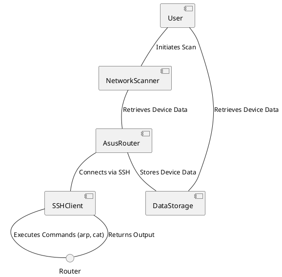
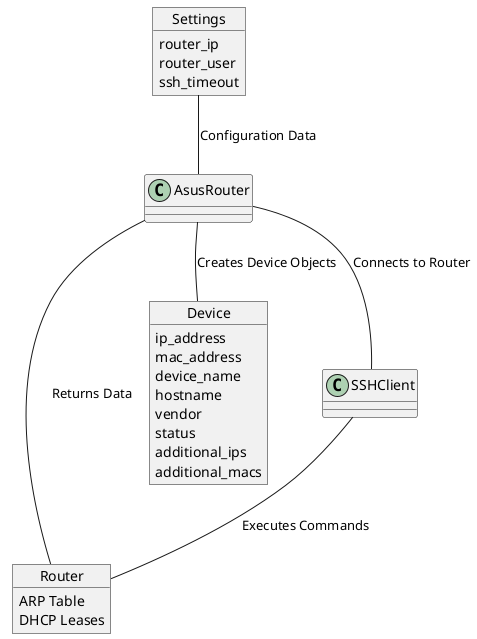

# netscan - Network Scanner

## 1. Summary

netscan is a Python-based network scanning tool designed to discover devices on a local network and gather information about them. From a user perspective, it provides a simple way to identify connected devices, their IP addresses, MAC addresses, hostnames, and vendor information. This tool is useful for network administrators, security enthusiasts, or anyone who wants to understand the devices connected to their network. It retrieves device information by connecting to a router via SSH and parsing the ARP table and DHCP leases.

## 2. Technical Summary

netscan uses a combination of techniques to identify devices on the network. It connects to an ASUS router via SSH, retrieves the ARP table and DHCP leases, and parses this data to identify connected devices. The tool leverages the `paramiko` library for SSH communication, `re` for parsing text, and `dynaconf` for configuration management.

Here's a high-level architecture diagram:



This diagram illustrates the main components of the `netscan` tool and their interactions. The `User` initiates the scan, the `NetworkScanner` uses the `AsusRouter` to retrieve device data, the `AsusRouter` connects to the router via `SSHClient` and executes commands, and the `DataStorage` component stores the discovered device data.

## 3. How it Works in Detail

The `netscan` tool operates in the following steps:

1.  **Configuration:** The tool loads settings from `config/settings.toml`, including the router IP address, username, and SSH timeout.
2.  **Router Connection:** The tool connects to the ASUS router via SSH using the `paramiko` library.
3.  **Data Retrieval:** The tool executes commands on the router to retrieve the ARP table (`arp -a`) and DHCP leases (`cat /var/lib/misc/dnsmasq.leases`).
4.  **Data Parsing:** The tool parses the output of these commands to extract device information, including IP addresses, MAC addresses, and hostnames.
5.  **Device Identification:** The tool uses the MAC address to look up the vendor information using the `mac_vendor_lookup` library.
6.  **Data Storage:** The discovered device data is stored in a JSON file (`device_data.json`) and updated with the latest information. The tool maintains a history of device IPs and MAC addresses, and tracks device status (online/offline).

## 4. Data Objects and Data Flow

The main data objects used in `netscan` are:

*   **Device:** Represents a network device with attributes such as IP address, MAC address, device name, hostname, vendor, and status.
*   **Settings:** Represents the configuration settings loaded from `config/settings.toml`.
*   **SSHClient:** Represents the SSH client used to connect to the router.

Here's a data flow diagram:



This diagram illustrates how the `Settings` object configures the `AsusRouter`, which then connects to the `Router` via `SSHClient` and retrieves data. The retrieved data is used to create `Device` objects, which represent the discovered devices on the network.

## 5. Installation and Usage

### Installation

1.  Clone the repository:
    ```bash
    git clone <repository_url>
    cd netscan
    ```
2.  Install the dependencies:
    ```bash
    pip install -r requirements.txt
    ```

### Usage

1.  Configure the `config/settings.toml` file with your router IP address, username, and SSH timeout.  You may need to set the `ROUTER_IP` environment variable.
2.  Run the `network_scanner.py` script:
    ```bash
    python network_scanner.py
    ```

### Command-Line Options

The `network_scanner.py` script supports the following command-line options:

*   `--update-mac-db`: Force update of the MAC vendor database.
*   `--debug`: Enable debug logging.
*   `--router-ip`: Router IP address (overrides config).

Example usage:

```bash
python network_scanner.py --update-mac-db --debug --router-ip 192.168.1.1
```

## 6. Extending netscan

netscan can be extended in several ways:

*   **Adding support for more routers:** You can add support for more router models by creating new classes that inherit from the `BaseRouter` class and implement the `get_device_data` method.
*   **Adding new scanning techniques:** You can add new scanning techniques to discover devices that may not be detected by the existing methods. This could include:
    *   Implementing direct ARP scanning from the host machine.
    *   Adding ping sweeping to discover devices that don't respond to ARP requests.
    *   Performing port scanning to identify open ports and services on discovered devices.
*   **Adding new device identification rules:** You can add new rules to identify more device types based on MAC address prefixes or other device attributes.
*   **Adding new data storage options:** You can add new data storage options to save the scan results to a file or database.
